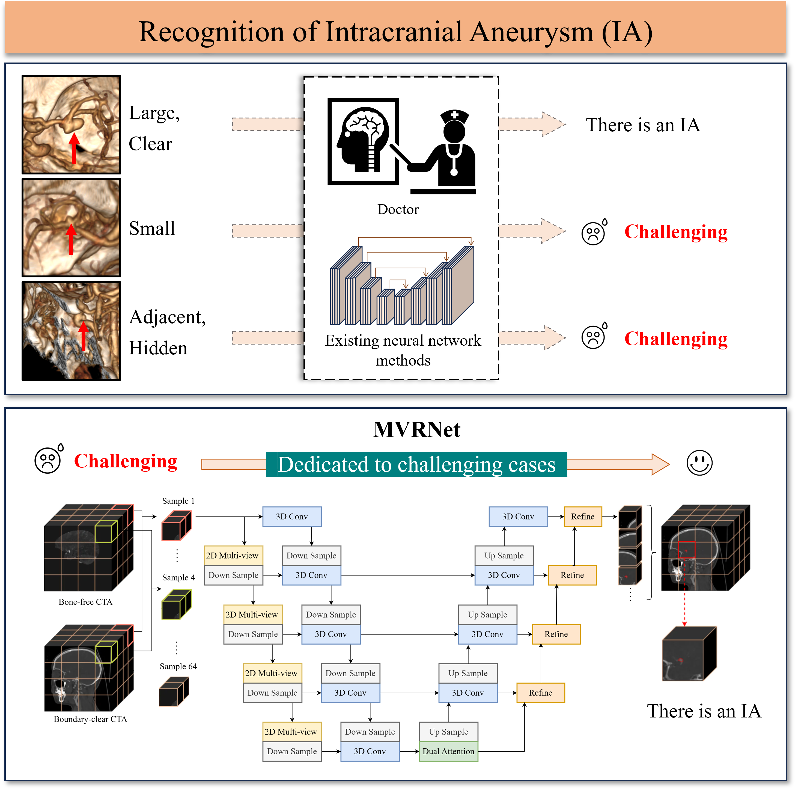

# MVRNet

### Introduction
We introduce MVRNet, a deep learning framework for detecting and segmenting intracranial aneurysms (IAs) in 3D CTA images, especially small or obscured lesions missed by conventional methods. Key innovations include:

* A feature enhancement technique to improve boundary clarity and reduce noise.

* A multi-view encoder to address occlusion, paired with a refinement decoder for precise predictions.

MVRNet outperforms state-of-the-art methods, boosting the F1-score by 24% and IoU by 16%, with >2× improvement on challenging cases.




### Checkpoints
We provide the pre-trained model of MVRNet in the `ckpt` directory.

### Dataset

We have released several samples in the `dataset` directory

```shell script
dataset
├── without_skull
│   ├── image
│   ├── mask
│   ├── lesion_bbox.txt
│   ├── test.txt
│   ├── train.txt
│   └── valid.txt
└── with_skull
    └── dicom2nifti_enhanced_v2
```

### Installation Environment

Follow the commands in `env_install.sh` to set up the environment.

### Train
Run command as below.
```shell script
bash run.sh
```

### Inference

Run command as below.
```shell script
bash evaluation.sh
```

### Data preprocessing

Please look at the EF-CTA folder and execute the Python files in sequence according to the README.


